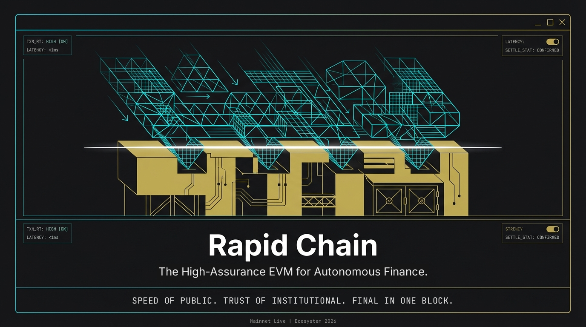

# Strategic Vision and Mission

#### 1.1. Executive Summary

**Rapid Chain** is a **high-assurance EVM network** built for the **AI Agent Economy** and **Real-World Asset (RWA) tokenization**. It pairs full Ethereum compatibility with **deterministic single-block finality** and **RAda**, a formally verified contract language for safety-critical financial logic.

The network is live, and so is its ecosystem. **RapidSwap**, **Rapid Order**, **Token Pilot**, **RocketPad**, **Rapid Wallet**, **Rapid Scan** and **SETUSD & SETBridge** are running on Rapid Chain today (see [Ecosystem](white-paper/ecosystem.md)).

Our **three-layer architecture** separates concerns where they matter most:

* **User Layer:** Wallets, exchanges, token tools and developer interfaces
* **Execution Layer:** Full EVM, the RAda high-assurance VM and the AI Agent Runtime
* **Finality Layer:** Deterministic BFT consensus. Every block is final the moment it is produced, and the validator set is governed by an on-chain contract

This design gives financial applications the **speed and openness of public markets** together with the **certainty institutions require**.

#### 1.2. The Core Philosophy: Certainty at Market Speed

**Rapid Chain** addresses a fundamental bottleneck in institutional blockchain adoption: **fast networks typically offer only probabilistic finality, while institutional systems offer certainty but not speed.**

The **Issuer Risk Reality** remains central to our philosophy: real-world assets (RWAs) like real estate, corporate bonds and structured products are inherently tied to their issuers, who need the legal and technical authority to manage compliance. Rapid Chain supports this with **protocol-level permissioning on demand**, so regulated assets can live in controlled zones on an otherwise open network.

**Rapid Chain's approach:**

* **Execution happens where speed and flexibility matter:** Complex lifecycle management, high-frequency netting and AI-driven decisions
* **Finality arrives in the very same block:** No confirmation window, no chain reorganisation, every state change auditable on Rapid Scan

#### 1.3. The Bridge Paradox, Handled Transparently

The digital asset landscape is fragmented into "liquidity islands," and moving value between them has historically meant opaque bridges and long confirmation waits. **Rapid Chain keeps bridging minimal, transparent and final.**

With **SETBridge**, every USDT locked on BNB Chain mints **SETUSD 1:1** on Rapid Chain. Each mint lands in a single, final block and can be verified on **Rapid Scan**. Once on Rapid Chain, trading, liquidity provision and settlement happen natively, with no further hops.

#### 1.4. Mission: The Agent Economy on Rapid Chain

The mission of Rapid Chain is to mature into the **foundational execution infrastructure** for institutional digital assets. Our objective is not to replace existing infrastructures but to **connect and enhance them**.

Rapid Chain creates a modular financial system where:

* **AI Agents** autonomously execute trades, manage risk and settle payments
* **RWA Tokenization** brings real estate, bonds and structured products on-chain
* **Developers** build and monetize specialized agents via the **AI Agent Marketplace**
* **Institutions** maintain sovereign control over their assets while accessing live on-chain liquidity

**We are building a future where:**

* Execution happens where **speed and intelligence** matter most
* Finality is **immediate and irreversible**, not "probably final"
* **AI agents** and **human institutions** transact seamlessly on a unified infrastructure
