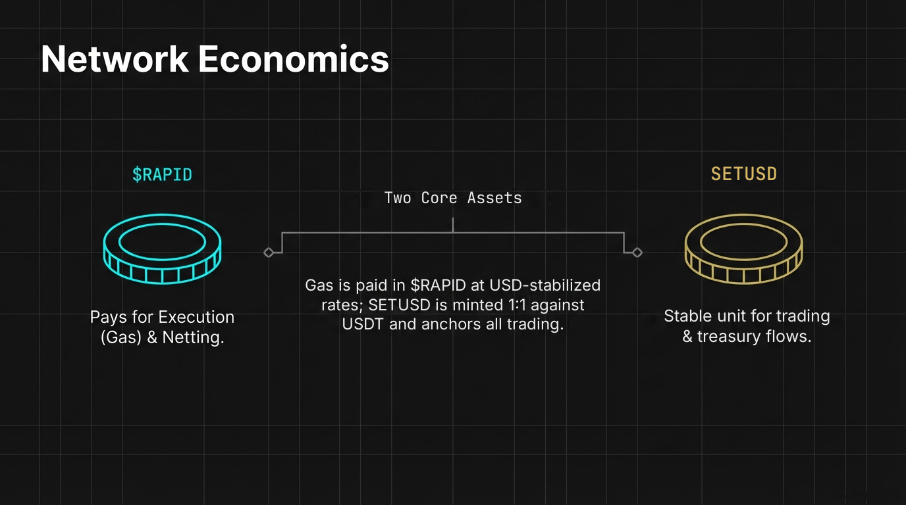

# Network Economics & Alignment

The economic framework of Rapid Chain is engineered to ensure long-term sustainability and institutional alignment. Because finality is native to the network, a single, predictable fee covers both execution and settlement — providing a scalable environment for complex financial operations.

#### 4.1. The Fee Model

Rapid Chain uses a simple, single-layer approach to network costs and incentives.

* Execution Metering ($RAPID): Computational resources within the EVM and RAda environments are metered using $RAPID. This allows for granular control over gas prices and resource allocation.
* Finality Included: Settlement happens in the same block as execution, so there is no secondary settlement or synchronization fee.
* Predictable Cost Structures: To meet institutional budgeting requirements, all fees are algorithmically stabilized to maintain a consistent USD-denominated value.

#### 4.2. The Two Core Assets



| **Economic Function** | **$RAPID**                                      | **SETUSD**                                                   |
| --------------------- | ----------------------------------------------- | ------------------------------------------------------------ |
| Primary Role          | Execution gas, validator staking, governance    | Native stablecoin and reference unit for trading             |
| Where It Is Used      | Every transaction, agent deployment, marketplace | Rapid Order (RAPID/SETUSD), RapidSwap pools, treasury flows |
| Issuance              | Network utility token                           | Minted 1:1 against USDT locked on BNB Chain via SETBridge    |
| Fee Denomination      | USD-Stabilized                                  | —                                                            |

#### 4.3. Logic Implementation: Fee Handling

This pseudocode demonstrates how the fee controller keeps execution costs stable in USD terms:

```
// Rapid Chain Economic Controller
contract EconomicAlignment {
    uint256 public constant USD_GAS_PRICE = 100; // Stabilized USD base

    function calculateTotalFee(uint256 gasUsed) public view returns (uint256) {
        // $RAPID execution fee based on current USD rates.
        // Finality is included — there is no separate settlement fee.
        return gasUsed * getRapidPriceOracle();
    }
}
```

#### 4.4. Validator Incentives

The network's security is maintained by a set of vetted, known entities. These validators are incentivized to maintain high uptime and deterministic performance through a structured reward system.

* Stake-Based Participation: Validators must stake $RAPID to participate in the BFT consensus, aligning their economic interests with the network's health.
* On-Chain Admission: Validators are added and removed through the on-chain validator contract, so every change to the set is transparent and auditable on Rapid Scan.
* Operational Rewards: Incentives are distributed based on the accuracy and speed of state transitions, rather than speculative drivers.
