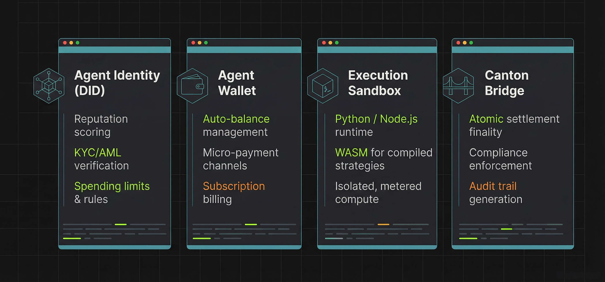

# Technical Architecture

#### 2.1. The Three-Layer Execution Stack

Rapid Chain is architected as a **native Execution Layer** within the **Canton Network ecosystem**. Unlike monolithic blockchains where every node processes every state change, Rapid Chain utilizes a **separation of concerns** that isolates high-frequency execution from legal settlement.

**Layer 1: User Interface**

* CRESP Investor Portal for RWA tokenization
* No-Code Agent Builder for AI agent deployment
* Analytics Dashboard for institutional monitoring

**Layer 2: Execution Layer (Rapid Chain)**

* **High-performance EVM** for standard smart contracts
* **RAda VM** for safety-critical, formally verified operations
* **AI Agent Runtime** for autonomous decision-making and execution
* **Micro-Payment Hub** for high-frequency agent-to-agent transactions
* **RAPALGO Engine** (Q3 2025) for cross-exchange intelligence and derivatives signals

**Layer 3: Settlement Layer (Canton Network)**

* Authoritative record of asset ownership
* Legal finality and regulatory compliance
* Privacy-preserving DAML smart contracts
* Global Synchronizer for atomic cross-domain transactions

**Sovereignty & Control:** Every participant maintains full sovereignty over their own ledger through Canton Participant Nodes, ensuring no third party can unilaterally fork or roll back their state.<br>


#### 2.2. AI Agent Runtime

The **AI Agent Runtime** is Rapid Chain's specialized environment for autonomous economic agents. Unlike traditional smart contracts that execute predefined logic, AI agents operate as **persistent, stateful entities** that can:

* **Perceive** market conditions via oracle feeds and API integrations
* **Decide** optimal actions using machine learning models or rule-based systems
* **Execute** transactions autonomously within defined risk parameters
* **Settle** payments instantly via the Micro-Payment Hub

\
**Agent Architecture:**

<figure><figcaption></figcaption></figure>

**Use Cases:**

* **Risk Agents:** Real-time collateral monitoring and margin call automation
* **Trading Agents:** Cross-exchange arbitrage and hedging signal execution
* **Payment Agents:** Automated invoice settlement and recurring payments
* **Oracle Agents:** External data validation and on-chain attestation


**Technical Implementation: Agent Execution Flow**

The following structure defines how an AI agent processes decisions and executes atomic settlements on Canton Network:

```python

# Rapid Chain AI Agent Runtime - Python SDK
from rapidchain import Agent, Wallet, CantonBridge

class RiskMonitoringAgent(Agent):
    """
    Autonomous agent for real-time collateral monitoring
    and automated margin call execution.
    """
    
    def __init__(self, config):
        super().__init__(
            name=config["agent_name"],
            wallet=Wallet.create(
                custody="zodia",
                spending_limit=config["max_daily_spend"]
            ),
            rules={
                "kyc_required": True,
                "audit_level": "full",
                "compliance_hooks": ["aml_check", "sanctions_screen"]
            }
        )
        
        # Link to Canton settlement layer
        self.canton = CantonBridge(
            participant_node=config["canton_node"],
            sync_mode="atomic_commit"
        )
        
    def on_price_threshold(self, market_signal):
        """
        Triggered when collateral value drops below threshold.
        Executes automated margin call with atomic settlement.
        """
        
        # 1. PERCEIVE: Validate market data
        if not self.validate_oracle(market_signal):
            self.log("Invalid oracle data - aborting")
            return False
            
        # 2. DECIDE: Calculate required collateral adjustment
        collateral_deficit = self.calculate_deficit(market_signal)
        
        if collateral_deficit > 0:
            # 3. EXECUTE: Prepare margin call instruction
            margin_call = {
                "target_domain": self.canton.domain_id,
                "asset_controller": self.wallet.custodian,
                "value": collateral_deficit,
                "instruction_type": "MARGIN_CALL",
                "compliance_proof": self.generate_compliance_proof()
            }
            
            # 4. SETTLE: Atomic commit to Canton
            tx_hash = self.canton.execute_atomic_intent(margin_call)
            
            self.log(f"Margin call executed: {tx_hash}")
            return tx_hash
            
        return None

    def validate_oracle(self, signal):
        """Multi-source oracle validation for price feeds."""
        consensus = self.query_oracle_consensus(
            sources=["chainlink", "internal", "canton_oracle"],
            threshold=0.95  # 95% agreement required
        )
        return consensus.valid

# Agent deployment and activation
if __name__ == "__main__":
    
    # Initialize agent with institutional parameters
    agent_config = {
        "agent_name": "RepoRiskMonitor_01",
        "max_daily_spend": 100000,  # USD
        "canton_node": "participant.zodia.canton.network"
    }
    
    agent = RiskMonitoringAgent(agent_config)
    
    # Register agent in Rapid Chain Marketplace
    agent.deploy(
        marketplace="rapid_chain_main",
        fee_share=0.70,  # 70% to agent owner
        subscription_price=500  # Monthly USD
    )
    
    # Start autonomous monitoring
    agent.start_listening(
        trigger="collateral_ratio",
        threshold=1.05  # 105% collateral threshold
    )
```


**Key Runtime Features:**

| Feature                    | Implementation                                                                           |
| -------------------------- | ---------------------------------------------------------------------------------------- |
| **Sandbox Isolation**      | Each agent runs in containerized environment with resource limits                        |
| **State Persistence**      | Agent memory and learning state stored in encrypted local database                       |
| **Canton Atomicity**       | All financial actions settle via `execute_atomic_intent()` with all-or-nothing guarantee |
| **Compliance Enforcement** | KYC/AML hooks execute before any state-changing operation                                |
| **Metered Execution**      | Compute and storage costs tracked in real-time, billed in RC tokens                      |


#### 2.3. The Global Synchronizer and Atomic Composability


The core of Rapid Chain's connectivity is the **Global Synchronizer**, which serves as the decentralized interoperability backbone of the Canton Network.

**Bridgeless Connectivity:** Transactions across different domains (e.g., Rapid Chain and a bank's private node) are synchronized atomically without intermediary bridges. This eliminates counterparty risk and smart contract vulnerabilities associated with traditional bridging.

**Blind Verification:** Super Validators facilitate synchronization by ensuring transaction delivery and sequencing without decrypting or viewing underlying financial data.

**Atomic Commit:** The network employs an "all-or-nothing" protocol where asset transfers and execution results are committed simultaneously across domains. A transaction either succeeds entirely or fails entirely, leaving no room for state mismatches.<br>

#### 2.4. Hybrid Execution Environment (EVM & RAda)

Rapid Chain provides a **dual-engine virtual machine** to serve both Web3 developers and high-assurance institutional systems.

**Full EVM Compatibility:** Standard Solidity smart contracts deploy immediately, enabling rapid migration of existing DeFi protocols while benefiting from Canton's institutional settlement.

**RAda High-Assurance VM:** For safety-critical operations—such as collateral netting, repo margin calls, and high-value settlements—RAda provides aerospace-grade formal verifiability. Every instruction has predictable, deterministic state transitions with mathematical proof of correctness.

**Selective Usage:** Developers choose the appropriate environment—EVM for rapid innovation, RAda for institutional-grade safety.


#### 2.5. Canton Integration: The DAML Adapter

Rapid Chain connects to Canton through a **native DAML adapter** that translates execution results into settlement instructions.**CantonIntegrationAdapter Interface:**

* Converts EVM/RAda/Agent execution outputs to DAML contract commands
* Maintains atomic consistency between execution and settlement states
* Enforces compliance hooks (KYC/AML) at the boundary layer

**Key Characteristics:**

* **Protocol-Level Synchronization:** No trusted intermediaries
* **Mathematical Finality:** Deterministic state transitions
* **Instant Settlement:** Sub-second execution-to-finality pipeline


#### 2.6. Performance and Scalability Parameters

| Feature                       | Institutional Specification                                      |
| ----------------------------- | ---------------------------------------------------------------- |
| **Consensus Mechanism**       | BFT-style for deterministic finality within vetted validator set |
| **Finality Time**             | Sub-second execution; Canton settlement finality                 |
| **Privacy Model**             | "Need-to-Know" access with data isolation                        |
| **State Separation**          | Execution offloaded from settlement layer                        |
| **Cross-Domain Transactions** | Atomic via Global Synchronizer                                   |
| **Smart Contract Support**    | EVM (Solidity) + RAda (High-Assurance)                           |
| **AI Agent Runtime**          | Python/Node.js/WASM with isolated sandbox                        |
| **Payment Throughput**        | 10K+ TPS for micro-payments; batched settlement                  |

<br>
