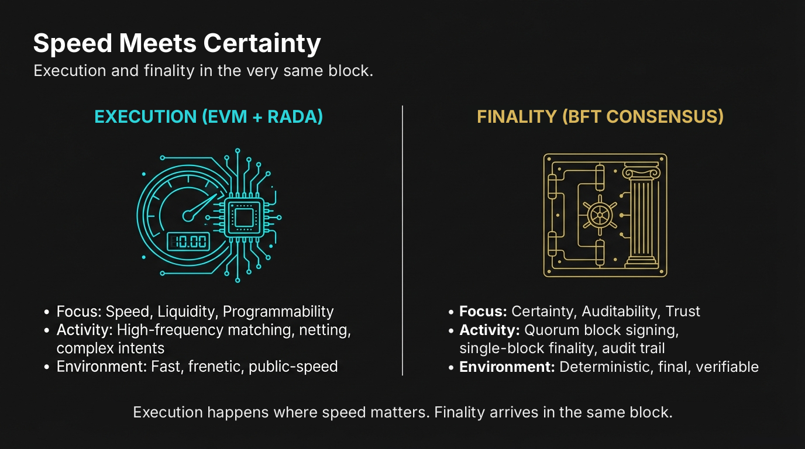
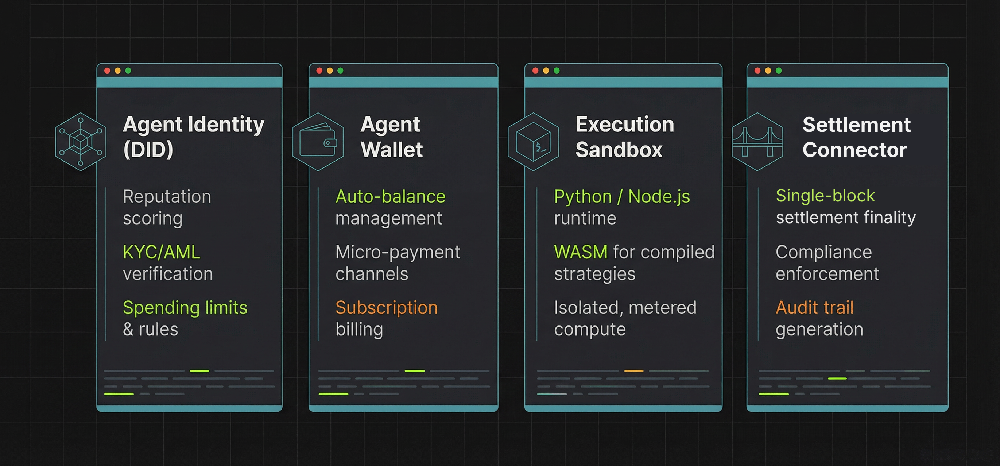

# Technical Architecture

#### 2.1. The Three-Layer Stack

Rapid Chain is a **high-assurance EVM network**. Instead of treating speed and certainty as a trade-off, it separates concerns so that high-frequency execution and final settlement happen in the **same block**.

**Layer 1: User Interface**

* Rapid Wallet for assets, tokens and dApp interactions
* RapidSwap (AMM) and Rapid Order (CLOB) trading interfaces
* Token Pilot and RocketPad for no-code token creation and launches
* No-Code Agent Builder for AI agent deployment
* Rapid Scan explorer for real-time monitoring and analytics

**Layer 2: Execution Layer**

* **Full EVM** for standard smart contracts
* **RAda VM** for safety-critical, formally verified operations
* **AI Agent Runtime** for autonomous decision-making and execution
* **Micro-Payment Hub** for high-frequency agent-to-agent transactions
* **RAPALGO Engine** for cross-exchange intelligence and derivatives signals

**Layer 3: Finality Layer**

* Deterministic BFT consensus — validators co-sign every block before it is appended
* Single-block finality — no forks to resolve, no reorganisation window
* Validator set governed by an on-chain smart contract
* Protocol-level permissioning, available on demand

**Sovereignty & Control:** Every participant keeps full control of their own keys, nodes and AI models. No state change can be forced without a valid, quorum-signed transaction, and no finalised block can ever be rolled back.



#### 2.2. AI Agent Runtime

The **AI Agent Runtime** is Rapid Chain's specialized environment for autonomous economic agents. Unlike traditional smart contracts that execute predefined logic, AI agents operate as **persistent, stateful entities** that can:

* **Perceive** market conditions via oracle feeds and API integrations
* **Decide** optimal actions using machine learning models or rule-based systems
* **Execute** transactions autonomously within defined risk parameters
* **Settle** payments instantly via the Micro-Payment Hub

**Agent Architecture:**

<figure><figcaption></figcaption></figure>

| Component                | Responsibilities                                                     |
| ------------------------ | -------------------------------------------------------------------- |
| **Agent Identity (DID)** | Reputation scoring, KYC/AML verification, spending limits & rules    |
| **Agent Wallet**         | Auto-balance management, micro-payment channels, subscription billing |
| **Execution Sandbox**    | Python / Node.js runtime, WASM for compiled strategies, metered compute |
| **Settlement Connector** | Single-block on-chain settlement, compliance enforcement, audit trail |

**Use Cases:**

* **Risk Agents:** Real-time collateral monitoring and margin call automation
* **Trading Agents:** Order placement on Rapid Order, liquidity management on RapidSwap and hedging signal execution
* **Payment Agents:** Automated invoice settlement and recurring payments in SETUSD
* **Oracle Agents:** External data validation and on-chain attestation

**Technical Implementation: Agent Execution Flow**

The following structure defines how an AI agent processes decisions and settles them on Rapid Chain:

```python
# Rapid Chain AI Agent Runtime - Python SDK (illustrative)
from rapidchain import Agent, Wallet, Settlement

class RiskMonitoringAgent(Agent):
    """
    Autonomous agent for real-time collateral monitoring
    and automated margin call execution.
    """

    def __init__(self, config):
        super().__init__(
            name=config["agent_name"],
            wallet=Wallet.create(
                custody="mpc",
                spending_limit=config["max_daily_spend"]
            ),
            rules={
                "kyc_required": True,
                "audit_level": "full",
                "compliance_hooks": ["aml_check", "sanctions_screen"]
            }
        )

        # Settle directly on Rapid Chain — final in a single block
        self.settlement = Settlement(
            network="rapid-chain",
            settlement_asset="SETUSD"
        )

    def on_price_threshold(self, market_signal):
        """
        Triggered when collateral value drops below threshold.
        Executes an automated margin call settled on-chain.
        """

        # 1. PERCEIVE: Validate market data
        if not self.validate_oracle(market_signal):
            self.log("Invalid oracle data - aborting")
            return False

        # 2. DECIDE: Calculate required collateral adjustment
        collateral_deficit = self.calculate_deficit(market_signal)

        if collateral_deficit > 0:
            # 3. EXECUTE: Prepare margin call instruction
            margin_call = {
                "collateral_vault": self.config["collateral_vault"],
                "asset": "SETUSD",
                "value": collateral_deficit,
                "instruction_type": "MARGIN_CALL",
                "compliance_proof": self.generate_compliance_proof()
            }

            # 4. SETTLE: The receipt is returned once the block is final
            receipt = self.settlement.execute(margin_call)

            self.log(f"Margin call settled in block {receipt.block_number}: {receipt.tx_hash}")
            return receipt.tx_hash

        return None

    def validate_oracle(self, signal):
        """Multi-source oracle validation for price feeds."""
        consensus = self.query_oracle_consensus(
            sources=["chainlink", "internal", "rapid_oracle_agent"],
            threshold=0.95  # 95% agreement required
        )
        return consensus.valid

# Agent deployment and activation
if __name__ == "__main__":

    # Initialize agent with institutional parameters
    agent_config = {
        "agent_name": "RepoRiskMonitor_01",
        "max_daily_spend": 100000,  # USD
        "collateral_vault": "0x..."  # Collateral contract on Rapid Chain
    }

    agent = RiskMonitoringAgent(agent_config)

    # Register agent in Rapid Chain Marketplace
    agent.deploy(
        marketplace="rapid_chain_main",
        fee_share=0.70,  # 70% to agent owner
        subscription_price=500  # Monthly USD
    )

    # Start autonomous monitoring
    agent.start_listening(
        trigger="collateral_ratio",
        threshold=1.05  # 105% collateral threshold
    )
```

**Key Runtime Features:**

| Feature                    | Implementation                                                                                       |
| -------------------------- | ---------------------------------------------------------------------------------------------------- |
| **Sandbox Isolation**      | Each agent runs in a containerized environment with resource limits                                  |
| **State Persistence**      | Agent memory and learning state stored in an encrypted local database                                |
| **Single-Block Settlement** | All financial actions settle via `settlement.execute()`; a receipt means the block is final — no rollback window |
| **Compliance Enforcement** | KYC/AML hooks execute before any state-changing operation                                            |
| **Metered Execution**      | Compute and storage costs tracked in real time, billed in $RAPID                                     |

#### 2.3. Deterministic Finality and Contract-Governed Validators

The core of Rapid Chain's reliability is its **finality engine**.

**Single-Block Finality:** Rapid Chain runs a deterministic BFT consensus protocol. Validators co-sign each block before it is appended; once the quorum has signed, the block is final. There are no forks to resolve and no "wait N confirmations" — a deposit, a trade or a margin call is final the instant its block exists.

**Contract-Governed Validator Set:** The list of validators lives in an on-chain smart contract. Adding or removing a validator is itself a transaction — public, timestamped and permanently auditable on Rapid Scan.

**Permissioning on Demand:** The protocol can enforce node- and account-level allowlists natively, without a custom fork or sidecar. Regulated participants can operate in controlled zones while the network as a whole stays open.

#### 2.4. Hybrid Execution Environment (EVM & RAda)


Rapid Chain provides a **dual-engine virtual machine** to serve both Web3 developers and high-assurance institutional systems.

**Full EVM Compatibility:** Standard Solidity smart contracts deploy unchanged, enabling rapid migration of existing DeFi protocols while benefiting from single-block finality. RapidSwap, Rapid Order and SETUSD all run on the EVM layer today.

**RAda High-Assurance VM:** For safety-critical operations—such as collateral netting, repo margin calls and high-value settlements—RAda provides aerospace-grade formal verifiability. Every instruction has predictable, deterministic state transitions with mathematical proof of correctness.

**Selective Usage:** Developers choose the appropriate environment—EVM for rapid innovation, RAda for institutional-grade safety.

#### 2.5. Interoperability: SETBridge

Rapid Chain connects outward without compromising its own finality. **SETBridge** links BNB Chain liquidity to Rapid Chain:

* Every USDT locked on BNB Chain mints **SETUSD 1:1** on Rapid Chain
* Each mint lands in a single, final block and is verifiable on Rapid Scan
* Once bridged, SETUSD trades natively on Rapid Order and in RapidSwap pools

**Key Characteristics:**

* **Transparent:** Every mint is publicly visible on Rapid Scan
* **Final:** No ambiguous "in-between" states on the Rapid Chain side
* **Secured contract:** SETUSD is built to OpenZeppelin v5 standards with role-based access control and an emergency pause mechanism

#### 2.6. Network Parameters

| Feature                    | Specification                                                         |
| -------------------------- | --------------------------------------------------------------------- |
| **Consensus Mechanism**    | Deterministic BFT with a contract-governed validator set              |
| **Finality**               | Single block — no confirmation wait, no reorganisation                |
| **Privacy Model**          | Public ledger by default; protocol-level permissioning on demand; staged ZK roadmap |
| **State Storage**          | Lean, flat, pruned state layout for fast sync on modest hardware       |
| **Interoperability**       | SETBridge (BNB Chain → Rapid Chain)                                    |
| **Smart Contract Support** | EVM (Solidity) + RAda (High-Assurance)                                 |
| **Developer APIs**         | JSON-RPC, WebSocket subscriptions, GraphQL                             |
| **Observability**          | Prometheus / OpenTelemetry metrics on every node                       |
| **AI Agent Runtime**       | Python / Node.js / WASM with isolated sandbox                          |
| **Micro-Payments**         | Batched via the Micro-Payment Hub                                      |
